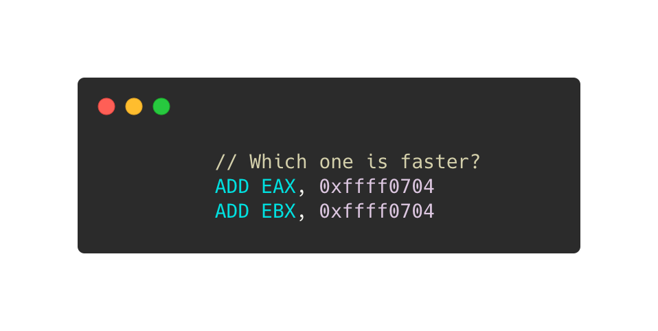
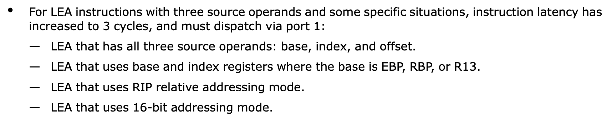

Instruction selection is a critical portion in compilers, as different instructions could cause significant performance differences even though the semantics not changed. Does register selection also matter to performance (assume the register selection does not lead to less or more register spills)? Honestly, I never intentionally thought of this question until I came across it on Zhihu (a Chinese Q&A website). But this is a really interesting topic that reflects many tricks of assembly programming and compiler code generation. So, that deserves a blog to refresh my memory and give a share :) 

In other words, the question is equivalent to 
> Is one of the instructions below faster than another one?  
  

And the question can be extended to any instruction of x86/x86-64 ISAs (not only on `ADD`).

From undergraduate classes in CS departments, we know modern computer architectures usually have a pipeline stage called __register renaming__ that assigns real physical registers to the named logic register referred to in an assembly instruction. For example, the following code uses `EAX` twice but the two usages are not related to each other.
```c
ADD EDX, EAX
ADD EAX, EBX
```
Assume this code is semantically correct. In practice, CPUs usually assign different physical registers to the two `EAX` for breaking [anti-dependency](https://en.wikipedia.org/wiki/Data_dependency#Anti-dependency). So they can parallel execute on pipelined superscalar CPUs, and `ADD EAX, EBX` does not have to worry about if writing over `EAX` impacts `ADD EDX, EAX`. __Therefore, we usually suppose different register names in assembly code do NOT cause performance difference on modern x86 CPUs.__

Is the story over? No.

The above statements only hold for general cases. There are a lot of corner cases existing in the real world that our college courses never reached. CPUs are pearls of modern engineering and industry, which also have many corner cases breaking our common sense. So, different register names will impact performance a lot, sometimes. I collected these corner cases in four categories. 

> Note, the rest of the article only talks about Intel micro-architectures. 

## Special Instructions 
A few instructions are executing slower with certain logic registers due to micro-architecture limitations. The most famous one is `LEA`. 
`LEA` was designed to leverage the complex and powerful x86 addressing-mode in wider areas, such as arithmetic computations, which requires fewer registers for intermediate results than arithmetic instructions. However, certain forms of `LEA` only can be executed on port1, which those `LEA` forms with lower ILP and higher latency are called __slow LEA__. According to the Intel optimization manual, using `EBP`, `RBP`, or `R13` as the base address will make LEA slower.
  


Although compilers could assign other registers to the base address variables, sometimes that is impossible in register allocations and there are more forms of slow LEAs that cannot be improved by register selection. Hence, in general, compilers avoid generating slow LEAs by (1) replacing `LEA` by equivalent instruction sequences that may need more temporary registers or (2) folding `LEA` into its user instructions' addressing modes.

## Partial Register Stall  
Most kinds of x86 registers (e.g., general-purpose registers, FLAGS, and SIMD registers, etc.) can be accessed by multiple granularities. For instance, `RAX` can be partially accessed via `EAX`, `AX`, `AH`, and `AL`. Accessing `AL` is independent of `AH` on Intel CPUs, but reading `EAX` content that written though `AL` has significant performance degradation (5-6 cycles of latency). Consequently, Intel suggests always using registers with sizes of 32- or 64-bit.


```c
MOV   AL,  BYTE PTR [RDI]
MOV   EBX, EAX // partial register stall

MOVZX EBX, BYTE PTR [RDI]
AND   EAX, 0xFFFFFF00
OR    EBX, EAX // no partial register stall

MOVZX EAX, BYTE PTR [RDI]
MOV   EBX, EAX // no partial register stall
```
Partial register stall is relatively easy to detect on general-purpose registers, but similar problems could happen on FLAGS registers and that is pretty covert. Certain instructions like `CMP` update all bits of FLAGS as the execution results, but `INC` and `DEC` write into FLAGS except `CF`. So, if `JCC` directly use FLAGS content from `INC`/`DEC`, `JCC` would possibly have false dependency from unexpected instructions.
```c
CMP EDX, DWORD PTR [EBP]
...
INC ECX
JBE LBB_XXX // JBE reads CF and ZF,  so there would be a false dependency from CMP
```
Consequently, on certain Intel architectures, compilers usually do not generate `INC`/`DEC` for loop count updating (i.e., `i++` of `for (int i = N; i != 0; i--)`) or reuse the `INC`/`DEC` produced FLAGS on `JCC`. On the flip side, that would increase the code size and make I-cache issues. Fortunately, Intel has fixed the partial register stall on FLAGS since [SandyBridge](https://en.wikipedia.org/wiki/Sandy_Bridge). But that still exists on most of the mainstream ATOM CPUs.


So far, you may already think of SIMD registers. Yes, the partial register stall also occurs on SIMD registers. 


But partial SIMD/FLAGS register stall is an instruction selection issue instead of register selection. Let's finish this section and move on.

## Architecture Bugs  
Certain Intel architectures (SandyBridge, Haswell, and Skylake) have [a bug](https://stackoverflow.com/questions/21390165/why-does-breaking-the-output-dependency-of-lzcnt-matter) on three instructions - `LZCNT`, `TZCNT`, and `POPCNT`. These three instructions all have 2 operands (1 source register and 1 destination register), but they are different from most of the other 2-operand instructions like `ADD`. `ADD` reads its source __and__ destination, and stores the result back to the destination register, which ADD-like instructions are called RMW (Read-Modify-Write). `LZCNT`, `TZCNT`, and `POPCNT` are not RWM that just read the source and write back to the destination. Due to some unknown reason, those Intel architectures incorrectly treat `LZCNT`, `TZCNT `, and `POPCNT` as the normal RWM instructions, which the `LZCNT`, `TZCNT `, and `POPCNT` have to wait for the computing results in both operands. Actually, only waiting for the source register getting done is enough.
```c
POPCNT  RCX, QWORD PTR [RDI]
...
POPCNT  RCX, QWORD PTR [RDI+8]
```
Assume the above code is compiled from an unrolled loop that iteratively computes bit-count on an array. Since each `POPCNT` operates over a non-overlapped `Int64` element, so the two `POPCNT` should execute totally in parallel. In other words, unrolling the loop by `2` iterations can make it at least 2x faster. However, that does not happen because Intel CPUs think that the second `POPCNT` needs to read `RCX` that written by the first `POPCNT`. So, the two `POPCNT` never gets parallel running.

To solve this problem, we can change the `POPCNT` to use a dependency-free register as the destination, but that usually complicates the compiler's register allocation too much. A simpler solution is to force triggering register renaming on the destination register via zeroing it.
```c
XOR     RCX, RCX // Force CPU to assign a new physical register to RCX
POPCNT  RCX, QWORD PTR [RDI]
...
XOR     RCX, RCX // Force CPU to assign a new physical register to RCX
POPCNT  RCX, QWORD PTR [RDI+8]
```
Zeroing `RCX` by `XOR RCX, RXC` or `SUB RCX, RCX` does not actually execute `XOR` or `SUB` operations that instructions just trigger register renaming to assign an empty register to `RCX`. Therefore, `XOR REG1, REG1` and `SUB REG1, REG1` do not reach the CPU pipeline stages behind register renaming, which makes the zeroing very cheap even though that increases CPU front-end pressures a bit.

## SIMD Registers  
Intel fulfills really awesome SIMD acceleration via SSE/AVX/AVX-512 ISA families. But there are more tricks on SIMD code generation than the scalar side. Most of the issues are not only about instruction/register selections but also impacted by instruction encoding, calling conventions, and hardware optimizations, etc.

Intel introduced `VEX` encoding with AVX that allows instructions to have an additional register to make the destination non-destructive. That is really good for register allocation on new SIMD instructions. However, Intel made a `VEX` counterpart for every old SSE instruction even though non-SIMD floating-point instructions. Then something gets messed up.
```c
MOVAPS  XMM0, XMMWORD PTR [RDI]
...
VSQRTSS XMM0, XMM0, XMM1 // VSQRTSS XMM0, XMM1, XMM1 could be much faster
```
`SQRTSS XMM0, XMM1` computes the square root of the floating point number in `XMM1` and writes the result into `XMM0`. The VEX version `VSQRTSS` requires 3 register operands, which copies the upper 64-bit of the second operand to the result. That makes `VSQRTSS` has additional dependencies on the second operand. For example,  in the above code, `VSQRTSS XMM0, XMM0, XMM1` has to wait for loading data into `XMM0` but that is useless for scalar floating-point code. You may think that we can let compilers always reuse the 3rd register at the 2nd position, `VSQRTSS XMM0, XMM1, XMM1`, to break the dependency. However, that does not work when the 3rd operand directly from a memory location, like `VSQRTSS XMM0, XMM1, XMMWORD PTR [RDI]`. In that situation, a better solution would insert `XOR` to trigger the register renaming for dst.

Usually, programmers think that using 256-bit YMM registers should get 2x faster than 128-bit XMM registers. Actually, that is not always true. Windows x64 calling conventions define [XMM0-XMM15 as callee saved registers](https://docs.microsoft.com/en-us/cpp/build/x64-calling-convention?view=vs-2019#callercallee-saved-registers), so using YMM0-YMM15 would cause more caller saving code than XMM registers. Moreover, Intel only implemented store forwarding for registers <= 128-bit, so that spilling YMM register could be more expensive than XMM. These additional overheads could reduce the benefits of using YMM.

## One More Thing
Look back at the very beginning code of this post, that seems not to fall into the above categories. But the 2 lines of code still may run in different performances. In the code section below, the comments show the instruction encoding, which means the binary representation of instructions in memory. We can see using `ADD` with `EAX` as dst register is 1-byte short than another, so that has higher code density and better cache-friendly.
```c
ADD EAX, 0xffff0704 // 05 04 07 FF FF
ADD EBX, 0xffff0704 // 81 C3 04 07 FF FF
```
Consequently, even though selecting `EAX` or other registers (like `EBX`, `ECX`, `R8D`, etc.) does not directly change `ADD`'s latency/throughput, it is also possible to impact the whole program performance.